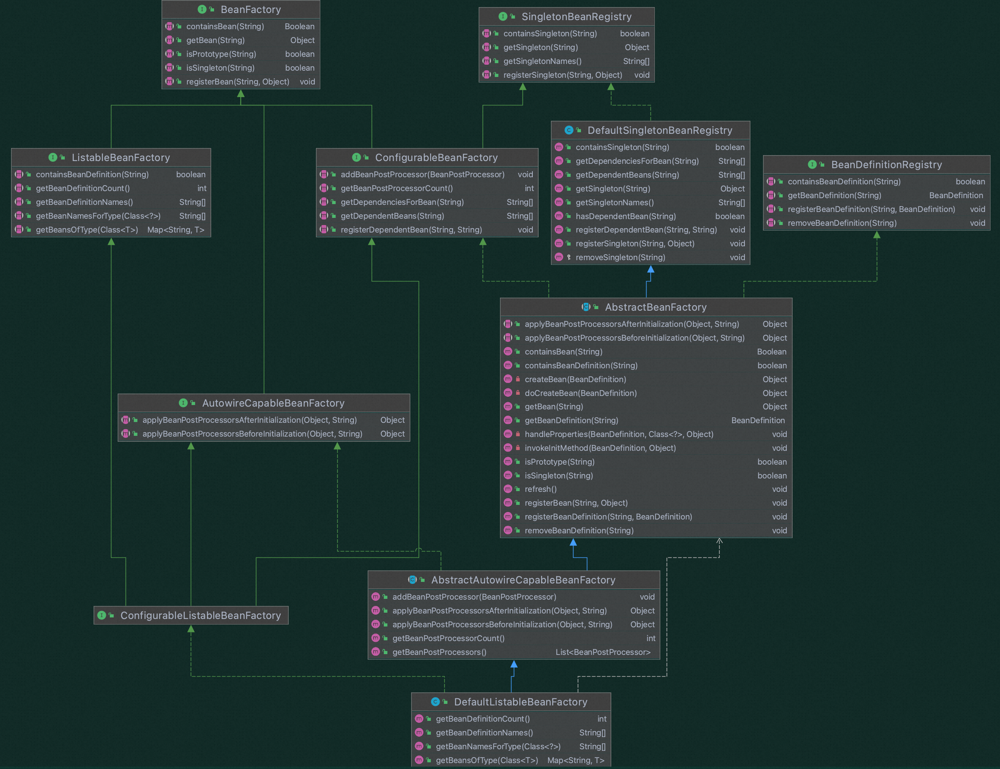
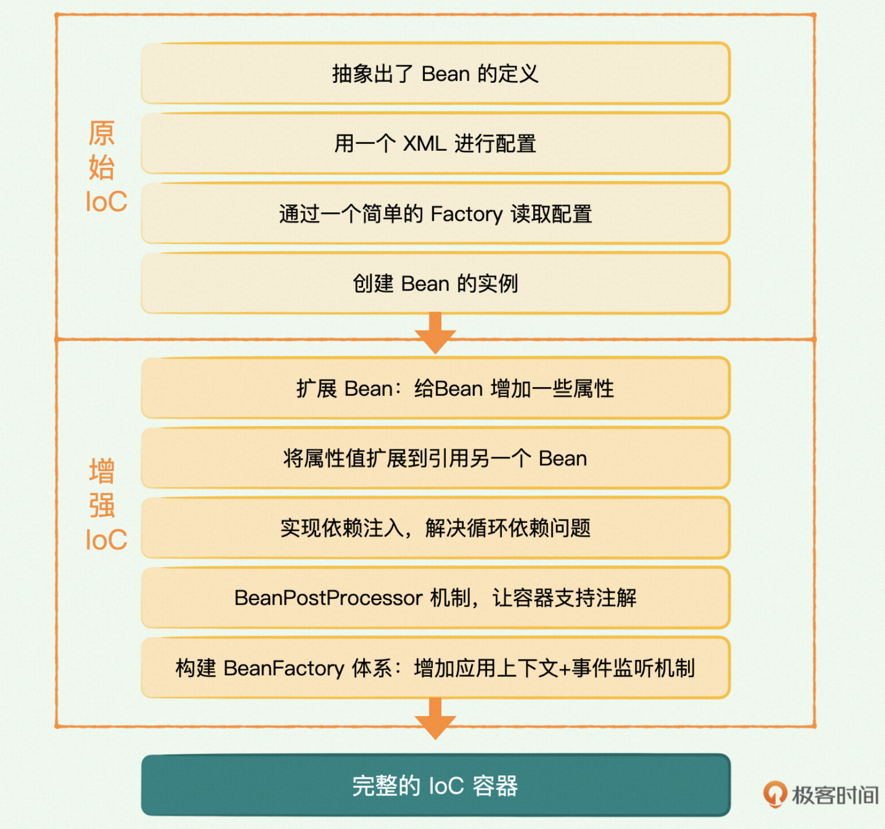
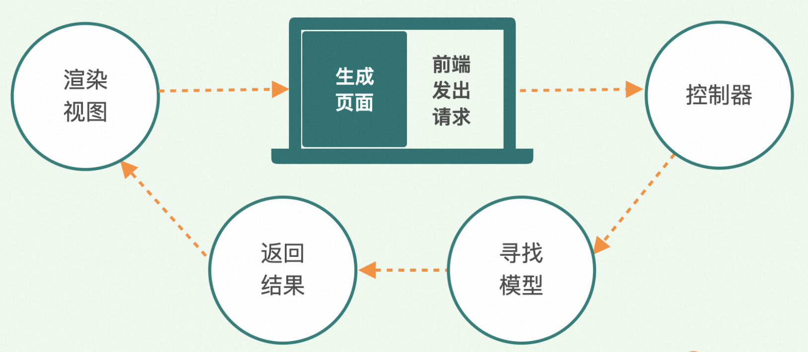
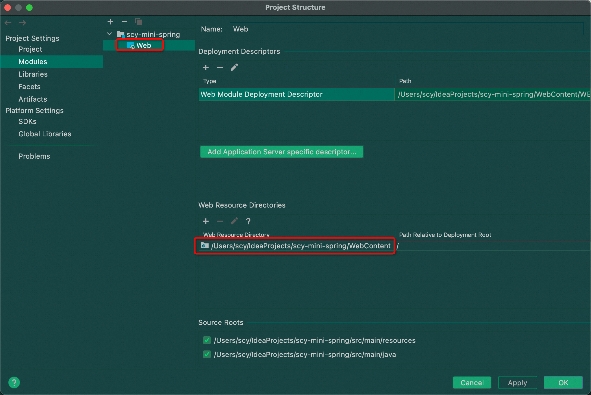
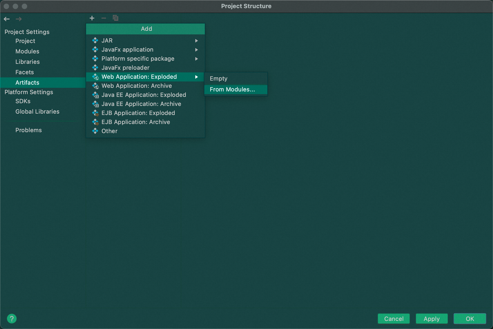
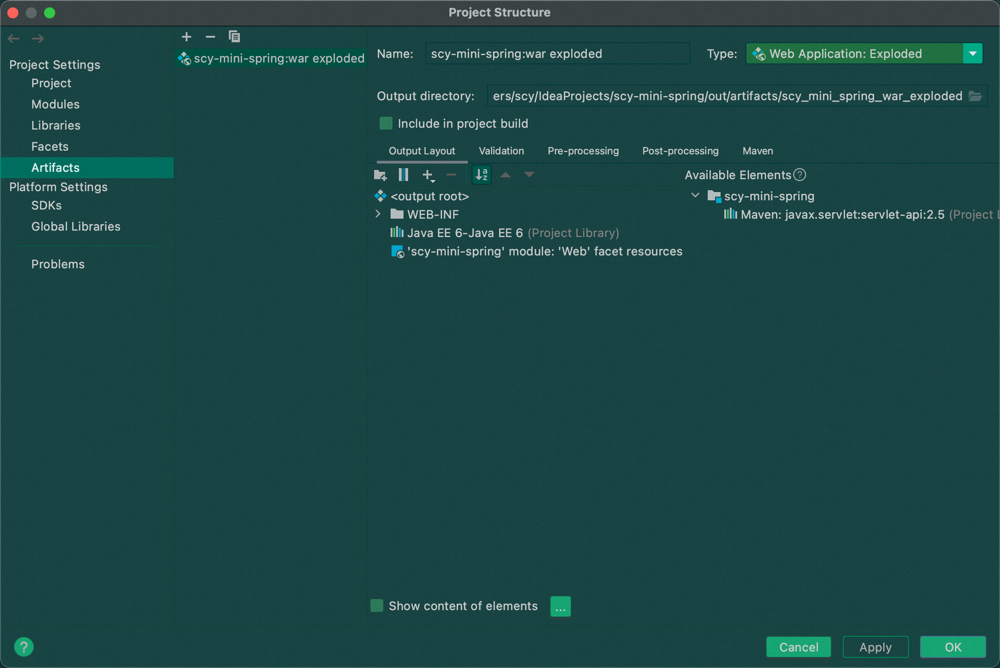
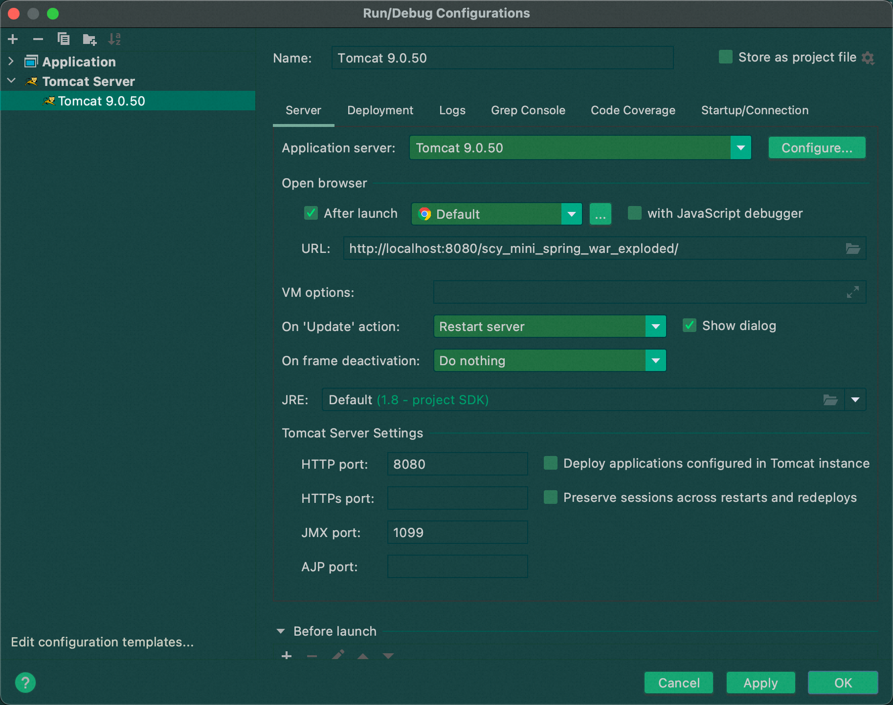
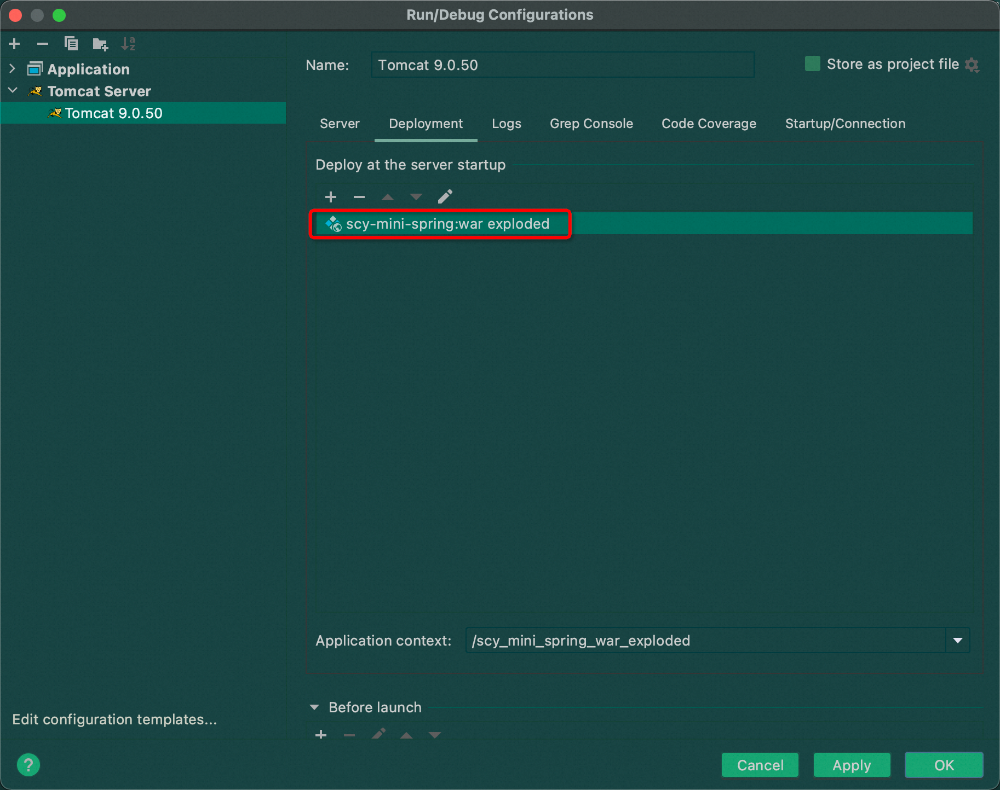
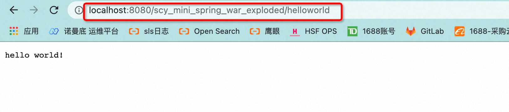

# IoC
### IoC 容器继承关系

### IoC 容器实现过程

# MVC
### MVC 处理流程

### 配置 Tomcat
为 module 添加 web，配置web资源目录 (web资源目录下需要有 web.xml 文件，配置后web资源目录会有小蓝点)

添加 artifact —— Web Application: exploded  
(注：artifacts 是 maven 中的一个概念，表示项目或modules如何打包，比如jar,war,war exploded,ear等打包形式。一个项目或module有了 artifacts 就可以部署到web应用服务器上了)

配置 tomcat Configuration，配置其 Deployment，添加 Artifact

启动 tomcat，访问 /helloworld

### Servlet 服务器启动过程
web.xml 文件是 Java 的 Servlet 规范中规定的，它里面声明了一个 Web 应用全部的配置信息。 
每个 Java Web 应用都必须包含一个 web.xml 文件，且必须放在 WEB-INF 路径下。 
web.xml 文件的顶层根是 web-app，指定命名空间和 schema 规定。  
web.xml 通常包含 context-param、Listener、Filter、Servlet 等元素。 

    <servlet></servlet>
    声明servlet类。    

    <servlet-mapping></servlet-mapping>
    声明servlet的访问路径，试一个方便访问的URL。  

    <display-name></display-name>  
    声明WEB应用的名字    

    <description></description>   
    声明WEB应用的描述信息    

    <context-param></context-param>
    声明应用全局的初始化参数。  

    <listener></listener>
    声明监听器，它在建立、修改和删除会话或servlet环境时得到事件通知。

    <filter></filter>
    声明一个实现javax.servlet.Filter接口的类。    

    <filter-mapping></filter-mapping>
    声明过滤器的拦截路径。

    <session-config></session-config>
    session有关的配置，超时值。

    <error-page></error-page>
    在返回特定HTTP状态代码时，或者特定类型的异常被抛出时，能够制定将要显示的页面。   

当 Servlet 服务器 (如 Tomcat) 启动时：
1. 读取 web.xml 文件中的 <context-param> 元素，获取web应用的全局参数，创建 ServletContext 上下文
2. 读取 <context-param> 元素，将其中的参数以键值对形式存入 ServletContext 中
3. 读取 < listener > 元素，创建其定义的监听器实例
4. 读取 < filter > 元素，创建过滤器实例
5. 读取 < servlet > 元素，创建 Servlet 实例 (根据参数 load-on-startup 的大小为优先级)

### MVC 整合 IoC
在创建 listener 的过程中，可以手动插入创建 IoC 容器的逻辑 (在 javax.servlet.ServletContextListener.contextInitialized 方法中) 
这样在 SpringMVC 中，就可以访问到 IoC 容器

### 拆分两级上下文
之前 IoC 容器是在 Listener 初始化时创建的，创建 IoC 容器时会实例化出 IoC 容器中管理的那些 Service 的 bean。 
Controller 类的实例化则是在 Servlet 初始化时 (com.minis.web.DispatcherServlet.init) 进行的。 
现在我们把 Controller 的实例化也交给 MVC 容器 (适用于Web的IoC容器) 去管理，将 MVC 容器拆分为上下两级：
1. XmlWebApplicationContext: 父级，启动在前。负责 IoC 容器的功能，用于创建原来 IoC 容器管理的 Service 类的实例
2. AnnotationConfigWebApplicationContext: 子级，启动在后。负责创建 Controller 类的实例。并且子级持有对父级的引用，可以访问到父级

### Dispatcher 设计模式
通过 HandlerMapping，将请求映射到处理器  
通过 HandlerAdapter，支持多种类型的处理器进行处理  
通过 ViewResolver 解析逻辑视图名到具体视图实现  

### 自动转换请求中的参数类型
处理HTTP请求时，只能用 ServletRequest.getParameter() 方法获取参数，返回值是字符串。 
因此希望 MVC 框架能自动解析HTTP请求中字符串格式的参数，把字符串转换成需要的类型，比如结构体。 

### 将web请求的处理结果返回给前端
调用目标方法得到返回值之后，有两种方式可以把处理结果返回给前端
1. 只返回数据。主流方式，这种方式可以实现前后端分离，后端只是把数据返回给前端，由前端自行渲染界面效果。
2. 返回一个页面。由后端 controller 根据某种规则拿到一个页面，把数据整合进去，然后整个回传给前端浏览器。典型的技术就是 JSP。

处理返回数据与处理参数相反，需要把后端的返回值 (Java对象) 按照某种字符串格式传给前端。

# JDBC
在 Java 体系中，数据访问的规范是 JDBC，也就是 Java Database Connectivity.  
JDBC 流程：

    1. 加载数据库驱动程序。
       JDBC 只是提供了一个访问的 API，具体访问数据库的实现是由不同厂商提供的数据库 Driver 实现的 (桥接模式)。对同一种数据库，可以有不同的 Driver。
    2. 获取数据库连接 (Connection 对象)
       建立和断开数据库连接的过程很耗时，所以需要利用数据库连接池技术来提高性能。
    3. 通过 Connection 对象创建 Statement 对象，Statement 对象是对一条 SQL 命令的包装
    4. 使用 Statement 执行 SQL 语句，获取返回的结果集 ResultSet
    5. 操作 ResultSet 结果集，转化为业务对象，执行后续的业务逻辑
    6. 回收数据库资源，关闭数据库连接，释放资源

代码：

    Class.forName("com.microsoft.sqlserver.jdbc.SQLServerDriver");
    con = DriverManager.getConnection("jdbc:sqlserver://localhost:1433;databasename=DEMO;user=testuser;password=test;");
    stmt = con.createStatement(sql); 
    rs = stmt.executeQuery();
    User user = null;
    if (rs.next()) {
        user = new User();
        user.setId(rs.getInt("id"));
        user.setName(rs.getString("name"));
    }
    rs.close();
    stmt.close();
    con.cloase();

### 连接 MySQL
homebrew 安装 MySQL
启动 mysql

    mysql.server start

navicat 连接 mysql，创建数据库、表

### 抽取 JdbcTemplate
把 JDBC 的标准流程作为模版固定下来，流程中可以变化的部分让子类重写。 
注意：需要引入 mysql-connector-java 包，设置 artifacts，使得编译后的 out 目录中包含 mysql-connector-java 的 jar 包。 
